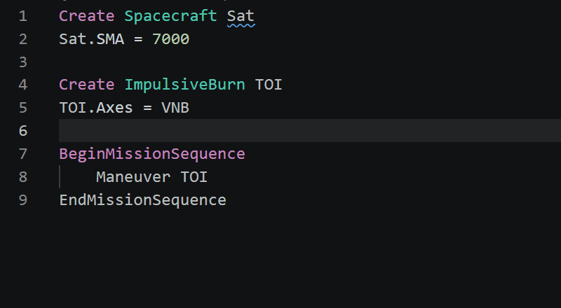

# GMAT Script for VS Code

Language support for [GMAT](https://gmat.atlassian.net/wiki/spaces/GW/overview) mission scripts —
`.script` and `.gmf` files — built on the [`gmat-script`](https://github.com/astro-tools/gmat-script)
tree-sitter grammar and language server.



## Features

- **Syntax highlighting** for resources, commands, fields, control flow, solver blocks, and
  GmatFunction headers — works on its own, no extra setup.
- **Hover** documentation: a field's type, default, allowed values, units, and reference target.
- **Live diagnostics** as you type: syntax errors plus linter warnings (unknown fields, enum
  violations, undeclared references, duplicate names, and more).
- **Go to definition** and **find all references** for resources.
- **Document outline / symbols**: every `Create`'d resource and GmatFunction header.
- **Completion**: resource names, the fields valid for the resource under the cursor, and a field's
  enum values.
- **Format on save** via the canonical, idempotent `gmat-script` formatter.

Highlighting comes from a bundled TextMate grammar and needs nothing else. Everything richer is
served by the `gmat-script` language server.

## Requirements

The richer features (hover, diagnostics, completion, definition, references, formatting) are powered
by the `gmat-script` language server, which runs on Python. Install it into a Python environment:

```console
$ pip install "gmat-script[lsp]"
```

This puts a `gmat-script-lsp` command on your `PATH`, which the extension launches automatically. If
it is not found, syntax highlighting still works and the extension points you here. To use a specific
interpreter or virtual environment instead, set `gmatScript.server.pythonPath`.

## Settings

| Setting | Default | Description |
|---|---|---|
| `gmatScript.server.path` | `gmat-script-lsp` | Command used to launch the language server. Set an absolute path if it is not on your `PATH`. |
| `gmatScript.server.pythonPath` | _(empty)_ | A Python interpreter with `gmat-script[lsp]` installed; when set, the server runs as `<python> -m gmat_script.lsp` and takes precedence over `server.path`. |
| `gmatScript.server.args` | `[]` | Extra arguments passed to the server on launch. |
| `gmatScript.trace.server` | `off` | Trace JSON-RPC traffic to the output channel (`off` / `messages` / `verbose`). |

Format on save is enabled for GMAT files by default; override it per the usual
`"[gmat]": { "editor.formatOnSave": false }` setting.

## Documentation

Full documentation for the grammar, formatter, linter, and language server lives at
<https://astro-tools.github.io/gmat-script/>.

## License

MIT.
